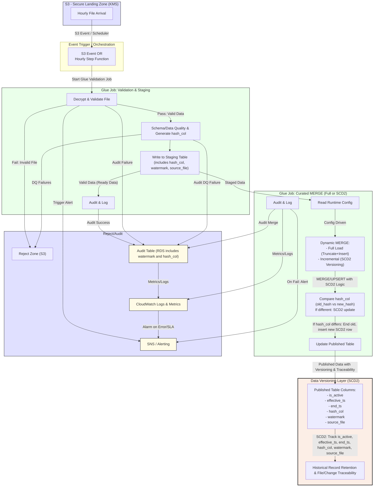

```mermaid
flowchart TD
  subgraph S3["S3 - Secure Landing Zone (KMS)"]
    A1["Hourly File Arrival"]
  end

  subgraph Trigger["Event Trigger / Orchestration"]
    B1["S3 Event OR<br>Hourly Step Function"]
  end

  subgraph Glue1["Glue Job: Validation & Staging"]
    C1["Decrypt & Validate File"]
    C2["Schema/Data Quality & Generate hash_col"]
    C3["Write to Staging Table<br/>(includes hash_col, watermark, source_file)"]
    C4["Audit & Log"]
  end

  subgraph Glue2["Glue Job: Curated MERGE (Full or SCD2)"]
    D1["Read Runtime Config"]
    D2["Dynamic MERGE:<br>- Full Load (Truncate+Insert)<br>- Incremental (SCD2 Versioning)"]
    D2a["Compare hash_col (old_hash vs new_hash)<br/>If different: SCD2 update"]
    D3["Update Published Table"]
    D4["Audit & Log"]
  end

  subgraph DV["Data Versioning Layer (SCD2)"]
    V1["Published Table Columns:<br>- is_active<br>- effective_ts<br>- end_ts<br>- hash_col<br>- watermark<br>- source_file"]
    V2["Historical Record Retention & File/Change Traceability"]
  end

  subgraph Rej["Reject/Audit"]
    R1["Reject Zone (S3)"]
    R2["Audit Table (RDS includes watermark and hash_col)"]
    R3["CloudWatch Logs & Metrics"]
    R4["SNS / Alerting"]
  end

  %% Flows
  A1-->|"S3 Event / Scheduler"|B1
  B1-->|"Start Glue Validation Job"|C1
  C1-->|"Pass: Valid Data"|C2
  C2-->C3
  C3-->|"Valid Data (Ready Data)"|C4
  C4-->|"Audit Success"|R2
  C3-->|"Staged Data"|D1

  C1-->|"Fail: Invalid File"|R1
  C1-->|"Audit Failure"|R2
  C1-->|"Trigger Alert"|R4
  C2-->|"DQ Failures"|R1
  C2-->|"Audit DQ Failure"|R2

  D1-->|"Config Driven"|D2
  D2-->|"MERGE/UPSERT with SCD2 Logic"|D2a
  D2a-->|"If hash_col differs: End old, insert new SCD2 row"|D3
  D3-->|"Published Data with Versioning & Traceability"|V1
  V1-->|"SCD2: Track is_active, effective_ts, end_ts, hash_col, watermark, source_file"|V2
  D4-->|"Audit Merge"|R2
  D4-->|"Metrics/Logs"|R3
  D4-->|"On Fail: Alert"|R4

  R2-->|"Metrics/Logs"|R3
  R3-->|"Alarm on Error/SLA"|R4

  %% Legends
  classDef storage fill:#e0e0ff,stroke:#000;
  classDef process fill:#eaffea,stroke:#000;
  classDef audit fill:#fffbe6,stroke:#000;
  classDef versioning fill:#fceee6,stroke:#000,stroke-width:2px;
  class S3,Rej storage;
  class Glue1,Glue2 process;
  class R2,R3,R4 audit;
  class DV versioning;
```